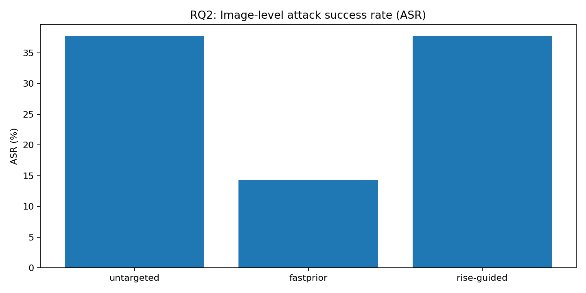

# One-pixel attacks and explanation stability

A reproducible study of sparse black-box adversarial attacks on a CIFAR-10 image classifier. The project compares differential-evolution one-pixel attacks with two explanation-guided variants, then measures how successful perturbations change Grad-CAM, Integrated Gradients, and RISE explanations.

## Questions and findings

1. **How do successful one-pixel attacks affect explanations?** All three methods changed on successful adversarial images; Integrated Gradients was the most stable under the study's overlap and rank-correlation measures. Deletion-based faithfulness fell on average for all three.
2. **Does responsibility-map guidance improve attack behaviour?** In the tested setup, RISE-guided search matched the untargeted baseline's image-level success rate without reducing median query cost. The fastprior variant found more explanation-stable successes in its selected subset, but its overall success rate was lower and its query cost higher.

The fixed evaluation used 10,000 CIFAR-10 test images, of which 9,213 were correctly classified and eligible for attack. The untargeted baseline and RISE-guided variant each succeeded on 3,477 eligible images (37.74%); fastprior succeeded on 1,310 (14.22%). These are results for one pretrained ResNet-20 model and the reported configurations, not general performance guarantees. See the [results](report/sections/results.tex), [conclusions](report/sections/conclusion.tex), and [claims-to-evidence map](docs/REPORT_EVIDENCE_MAP.md) for definitions and caveats.



## Reproduce a small run

Use Python 3.10 or newer. PyTorch is a substantial dependency; a CUDA GPU is helpful for full runs. The first run downloads CIFAR-10 and pretrained model weights through `torchvision` and `torch.hub`.

```bash
python3 -m venv .venv
source .venv/bin/activate
python -m pip install -r requirements.txt
python scripts/eval_cifar10.py --limit 100
python -m scripts.run_one_pixel untargeted --limit 6 --pop 96 --max-gens 15 --out tmp/smoke/untargeted.csv
```

The last command is a small smoke run. It does not reproduce the 10,000-image study or its headline percentages. `python -m scripts.run_one_pixel --help` lists attack variants and options; the `Makefile` includes further smoke workflows. Larger experiments can require long runtimes and significant storage.

## Repository guide

| Path | Contents |
| --- | --- |
| `attacks/` | One-pixel differential-evolution variants |
| `explanations/` | Grad-CAM, Integrated Gradients, RISE, and comparison metrics |
| `scripts/` | Evaluation, attack, explanation, summary, and plot entry points |
| `report/` | Dissertation source, tables, and figures |
| `results/` | Saved experiment artefacts used by the report |
| `docs/` | Study notes and evidence mapping |

The results directory includes large historical outputs. New local datasets and scratch outputs belong under `data/` and `tmp/`, respectively. The report's scientific limitations are stated in its [conclusion](report/sections/conclusion.tex): one dataset, one main architecture, one sparse threat model, and explanation analysis on successful adversarial subsets only.

## Checks

The repository's GitHub Actions workflow runs its configured pre-commit checks on pushes and pull requests. The research results are supported by the saved artefacts and report; CI is a code-quality check, not a rerun of the full experiments.
